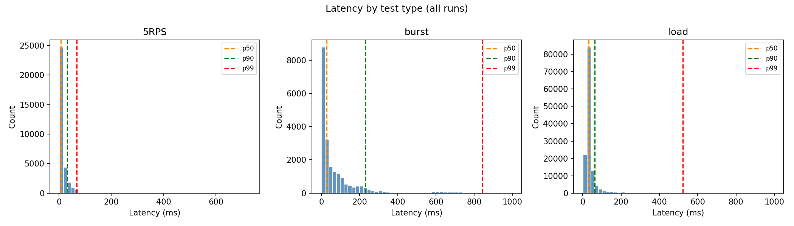
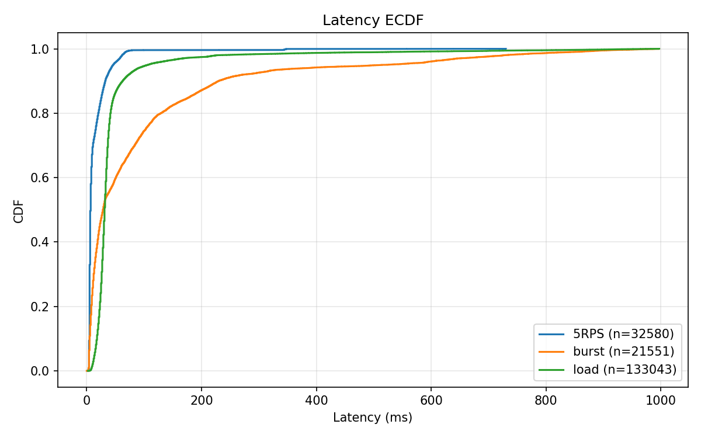
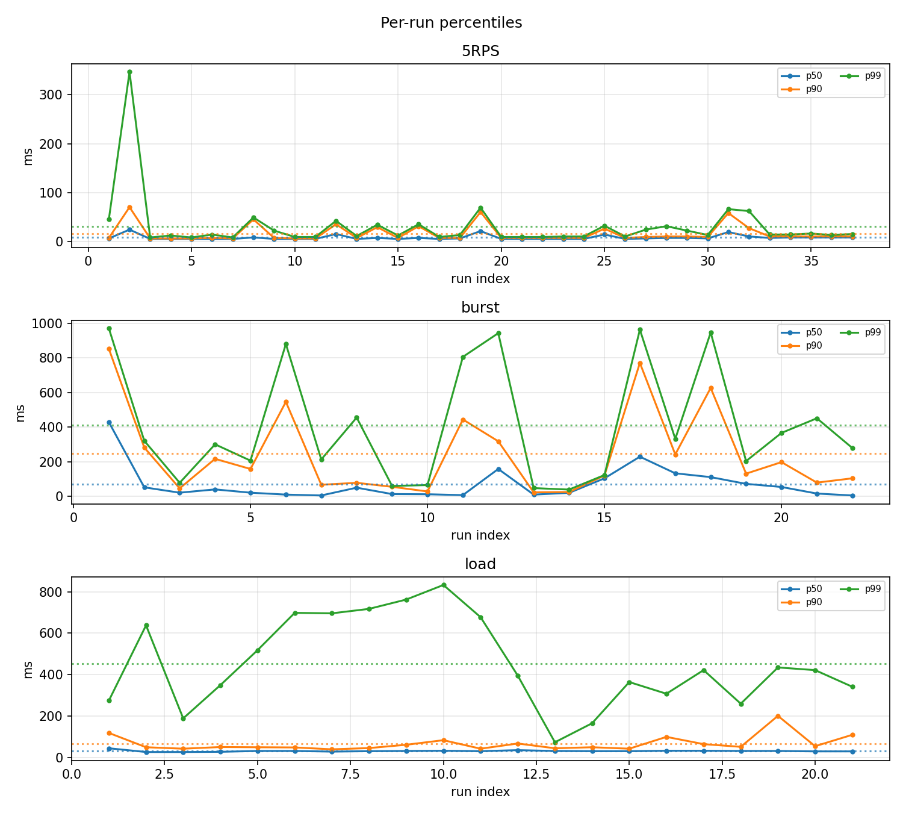

# e2e latency summary (ms)

Header line: `wrk_requests,applied_log_lines`. Loss ≈ max(0, (Σwrk−Σapplied)/Σwrk)×100%.

## 5RPS
- Loss: **0.00%** (wrk 30050, applied 32580)
- Test runs: 50, samples 32580, mean p50/p90/p99: 7.76 / 16.11 / 30.68 ms, min/max 2.00 / 730.00
- 95% CI (mean per-run): p50 [6.23, 9.28], p90 [10.62, 21.59], p99 [12.57, 48.78] ms

## burst
- Loss: **0.00%** (wrk 24080, applied 29010)
- Test runs: 35, samples 29010, mean p50/p90/p99: 71.43 / 245.87 / 411.30 ms, min/max 0.00 / 997.00
- 95% CI (mean per-run): p50 [29.98, 112.88], p90 [142.15, 349.59], p99 [268.77, 553.83] ms

## load
- Loss: **7.29%** (wrk 209266, applied 194021)
- Test runs: 35, samples 133043, mean p50/p90/p99: 31.76 / 67.93 / 454.45 ms, min/max 2.00 / 997.00
- 95% CI (mean per-run): p50 [30.18, 33.34], p90 [51.58, 84.28], p99 [361.72, 547.18] ms

## Plots

