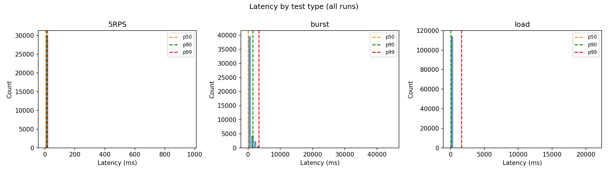
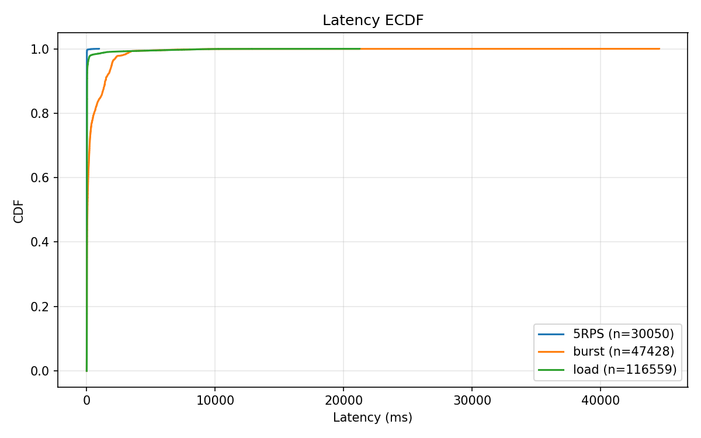
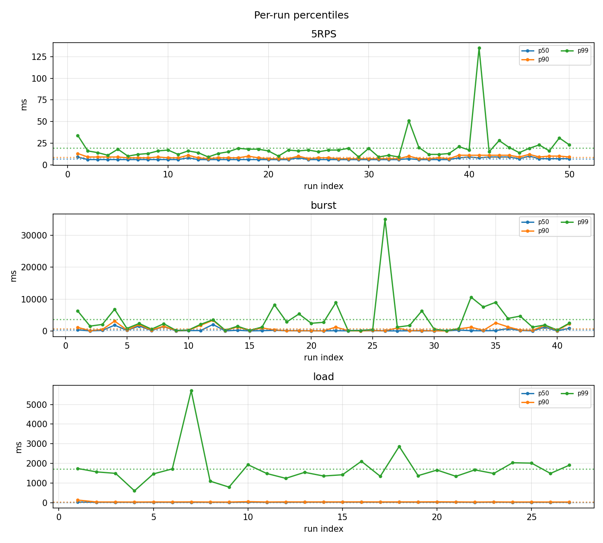

# e2e latency summary (ms)

Header line: `wrk_requests,applied_log_lines`. Loss ≈ max(0, (Σwrk−Σapplied)/Σwrk)×100%.

## 5RPS
- Loss: **0.00%** (wrk 30050, applied 30050)
- Files 50, samples 30050, mean p50/p90/p99: 6.66 / 8.66 / 19.32 ms, min/max 4.00 / 963.00
- 95% CI (mean per-run): p50 [6.35, 6.97], p90 [8.22, 9.10], p99 [14.29, 24.35] ms

## burst
- Loss: **0.00%** (wrk 46606, applied 47428)
- Files 50, samples 47428, mean p50/p90/p99: 300.48 / 743.58 / 3653.80 ms, min/max 3.00 / 44546.00
- 95% CI (mean per-run): p50 [138.80, 462.15], p90 [468.09, 1019.07], p99 [1881.51, 5426.08] ms

## load
- Loss: **26.91%** (wrk 159471, applied 116559)
- Files 27, samples 116559, mean p50/p90/p99: 21.93 / 37.94 / 1719.20 ms, min/max 2.00 / 21234.00
- 95% CI (mean per-run): p50 [20.58, 23.27], p90 [30.81, 45.07], p99 [1377.77, 2060.63] ms

## Plots

