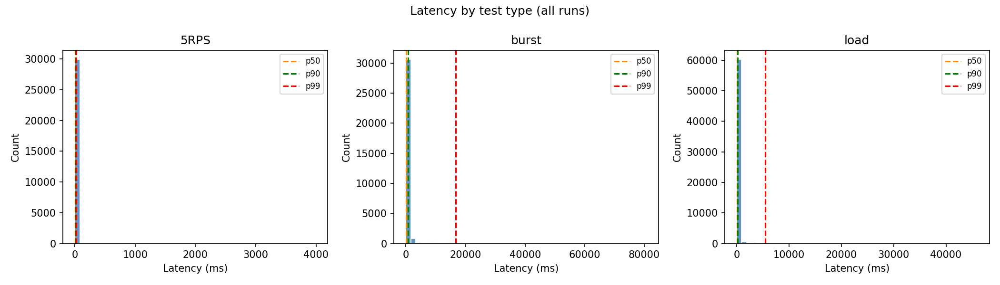
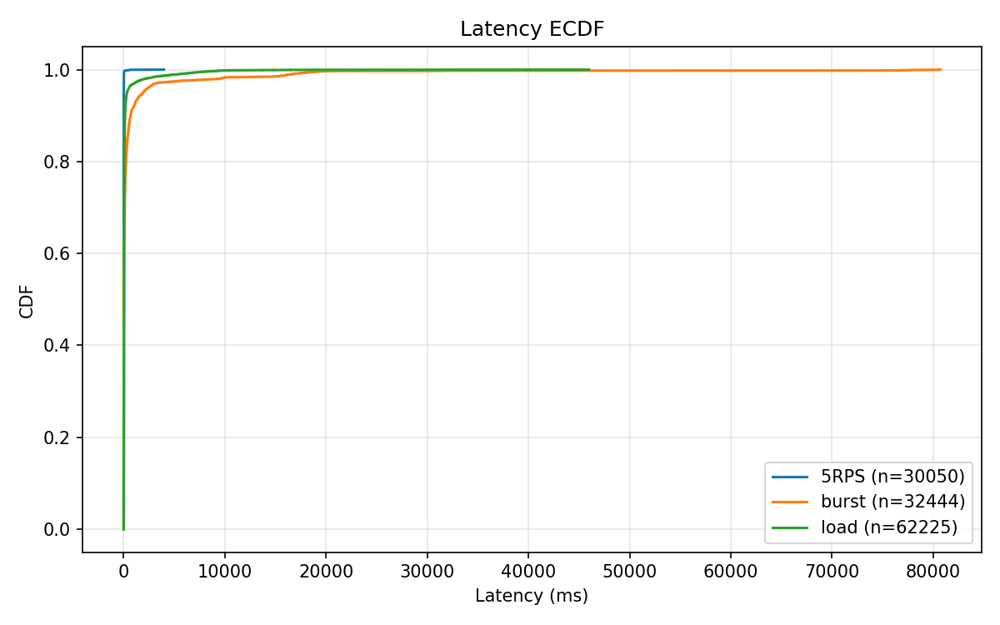
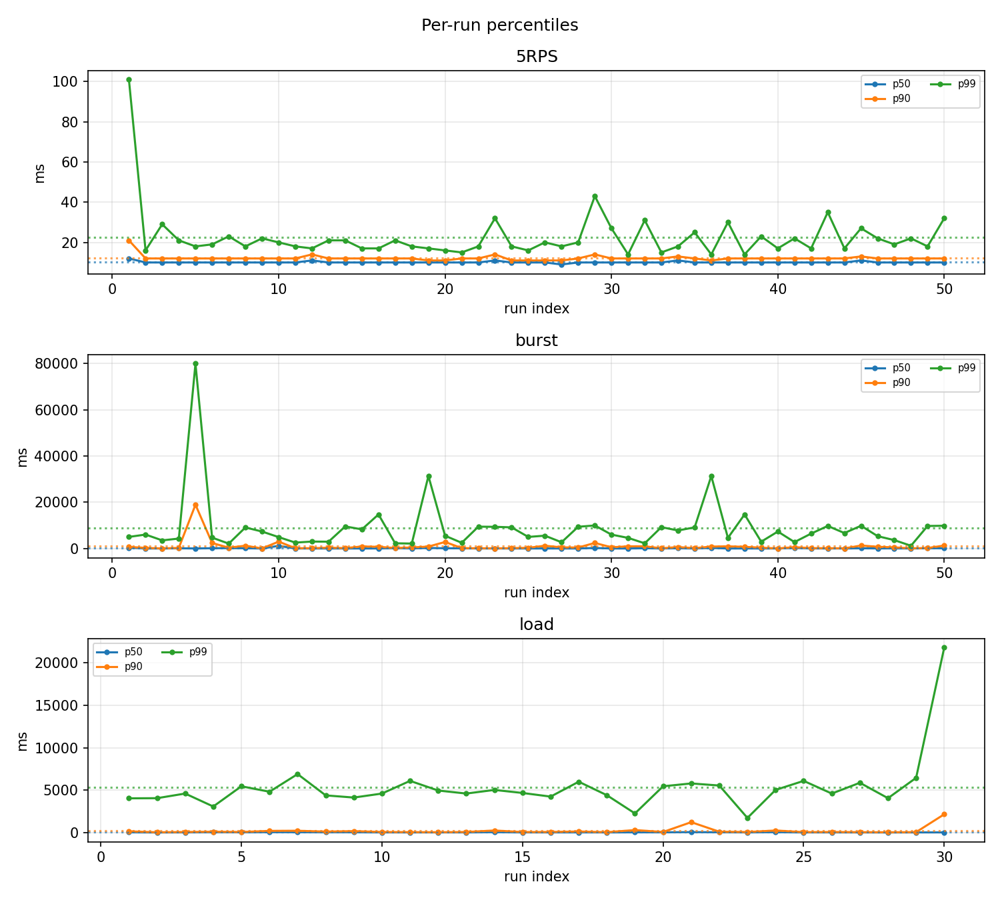

# e2e latency summary (ms)

Header line: `wrk_requests,applied_log_lines`. Loss ≈ max(0, (Σwrk−Σapplied)/Σwrk)×100%.

## 5RPS
- Loss: **0.00%** (wrk 30050, applied 30050)
- Files 50, samples 30050, mean p50/p90/p99: 10.10 / 12.20 / 22.58 ms, min/max 3.00 / 3990.00
- 95% CI (mean per-run): p50 [9.98, 10.22], p90 [11.80, 12.60], p99 [19.03, 26.13] ms

## burst
- Loss: **9.03%** (wrk 35698, applied 32473)
- Files 50, samples 32444, mean p50/p90/p99: 87.91 / 1007.27 / 8752.54 ms, min/max 3.00 / 80710.00
- 95% CI (mean per-run): p50 [40.28, 135.54], p90 [264.42, 1750.12], p99 [5466.01, 12039.07] ms

## load
- Loss: **25.92%** (wrk 84002, applied 62225)
- Files 30, samples 62225, mean p50/p90/p99: 44.25 / 226.54 / 5363.35 ms, min/max 4.00 / 45979.00
- 95% CI (mean per-run): p50 [40.20, 48.30], p90 [74.33, 378.74], p99 [4181.60, 6545.09] ms

## Plots

